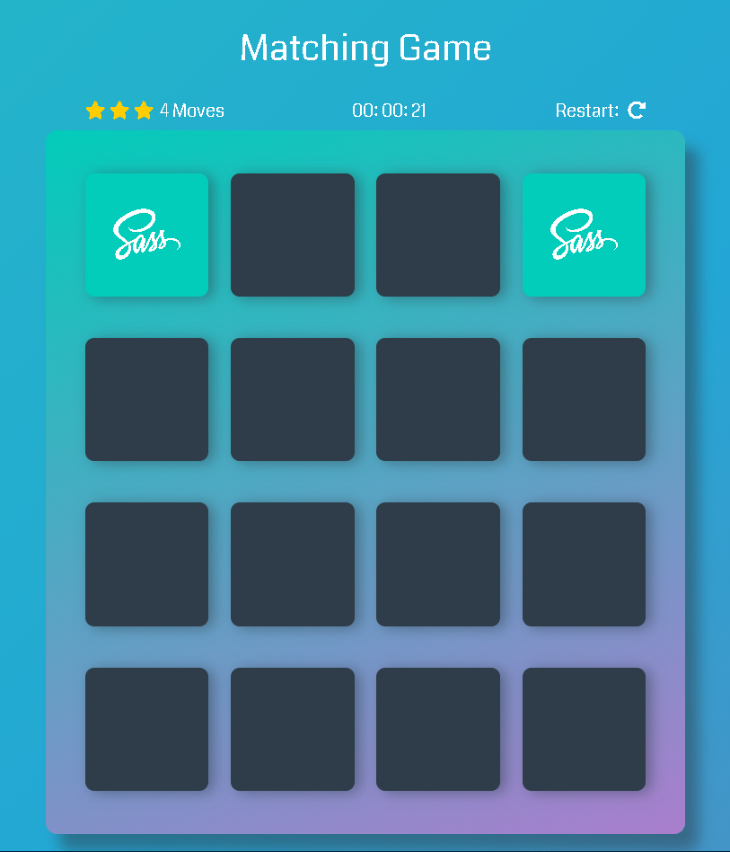
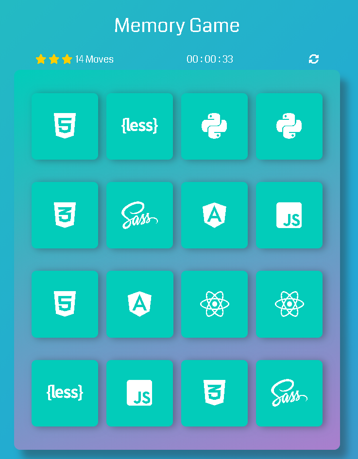
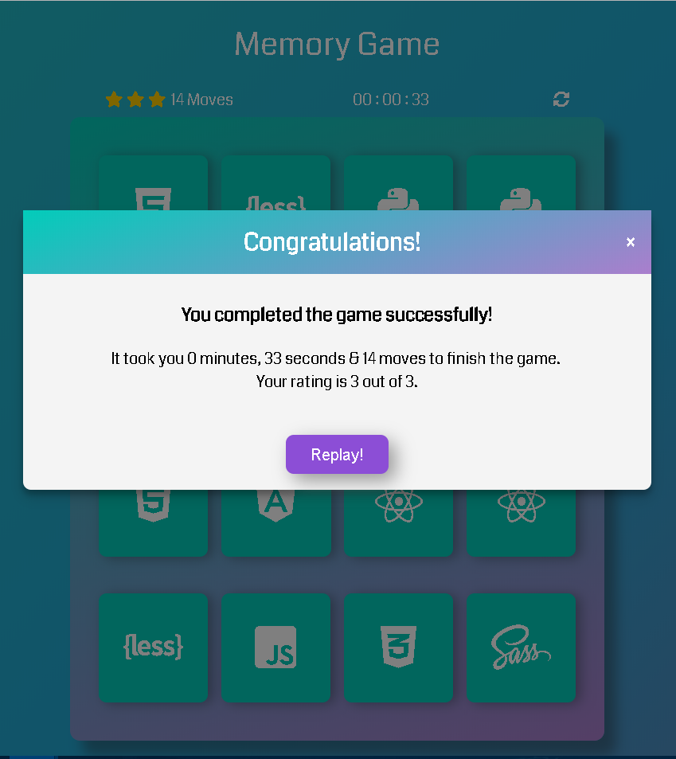

# Memory Game Project

Memory Game is a complete browser-based card matching game (also known as Concentration). But this isn’t just any memory game! It’s a shnazzy, well-designed, feature-packed memory game!

You can access the memory game from [this link](https://htmlpreview.github.io/?https://github.com/ogasimli/udacity-Memory-Game/blob/master/index.html).

## Table of Contents

* [Game Rules](#game-rules)
* [Technical](#technical)
* [Credits](#credits)
* [Tools Used](#tools-used)

## Game Rules

The game board consists of sixteen "cards" arranged in a grid. The deck is made up of eight different pairs of cards, each with different symbols on one side. The cards are arranged randomly on the grid with the symbol face down. The gameplay rules are very simple: flip over two hidden cards at a time to locate the ones that match!

Each turn:

* The player flips one card over to reveal its underlying symbol.
* The player then turns over a second card, trying to find the corresponding card with the same symbol.
* If the cards match, both cards stay flipped over.
* If the cards do not match, both cards are flipped face down.
* The game ends once all cards have been correctly matched.

1.Correct match

2.Completed board

3.Game over modal

## Technical

This project consists of the following assets:

* **index.html**  - contains the game's html structure.
* **main.css** - contains the game's board styling.
* **app.js** - contains all the board actions & logic.

## Credits

* For shuffling the cards **shuffle** javaScript function was used from http://stackoverflow.com/a/2450976

## Tools Used

* [Fontawesome](http://fontawesome.io/icons/) was used to display game card's icons.
